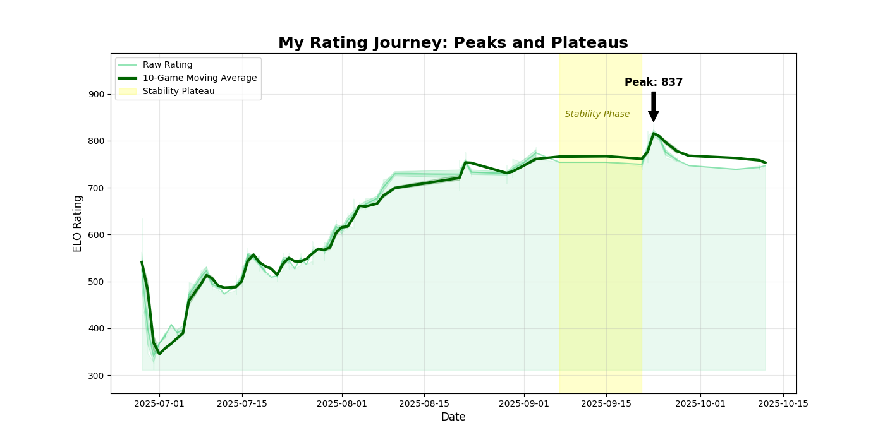
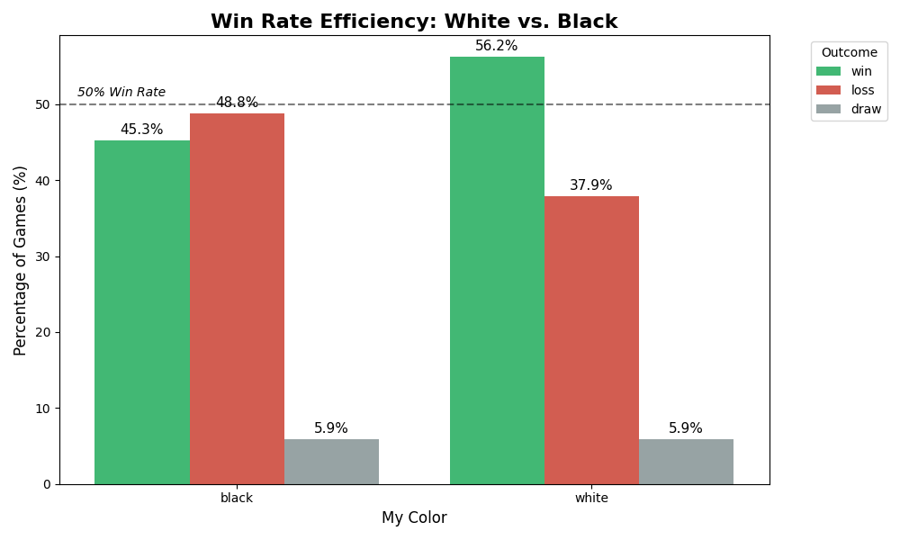
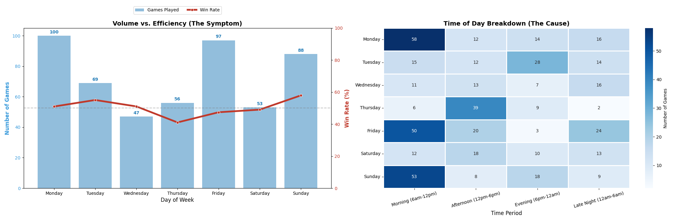
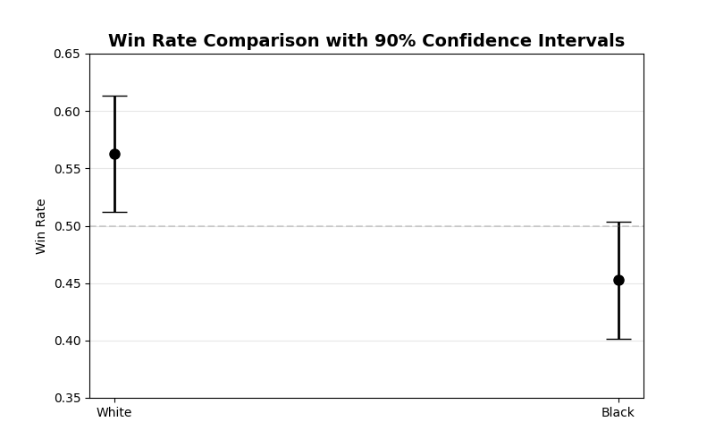
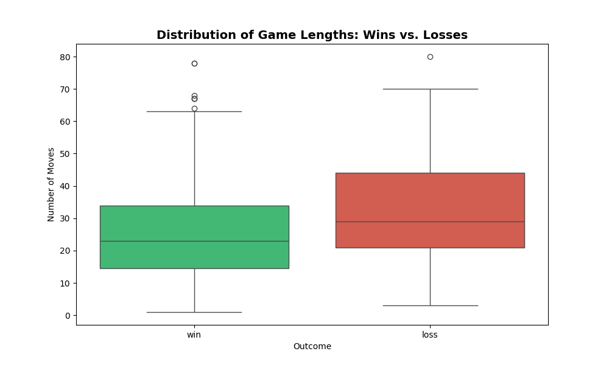

# Checkmate with Data: A Quantitative Analysis of Personal Chess Performance

**Student:** Moeed ur Rehman  
**Sabanci ID:** 36128  
**Course:** DSA 210 - Introduction to Data Science  
**Term:** Fall 2025  

---

## 1. Project Motivation
During the Summer of 2025, I dedicated significant time to playing Rapid Chess on Chess.com. Like many amateur players, I experienced periods of rapid improvement followed by frustrating stagnation. I often relied on intuition to assess my play ("I feel like I play worse at night," or "I think I'm bad with Black pieces").

**The goal of this project is to replace intuition with evidence.** By building a full Data Science pipeline—from API extraction to Statistical Inference—I aim to uncover the hidden patterns in my game history, quantify my weaknesses, and derive actionable insights to reach the next ELO milestone.

---

## 2. Data Pipeline & Methodology

### 2.1 Data Acquisition
*   **Source:** [Chess.com Public API](https://www.chess.com/news/view/published-data-api).
*   **Tooling:** Python script (`scripts/01_fetch_data.py`) using `requests` for API calls and `chess.pgn` for parsing game moves.
*   **Volume:** 500+ games collected.

### 2.2 Data Cleaning & Filtering
To ensure statistical validity, the raw data required significant preprocessing:
*   **Game Mode Filtering:** The dataset contained a mix of Blitz, Bullet, and Daily games. To ensure rating consistency, I filtered strictly for **Rapid (10 min clock)** games.
*   **Timeframe:** Filtered for games played post-June 2025 to focus on the "Summer Journey."
*   **Feature Extraction:** Parsed raw PGN strings to extract specific opening names (e.g., "Scotch Game") and move counts.
*   **Timezone Adjustment:** Converted Unix timestamps to local time to analyze circadian rhythms in performance.

---

## 3. Exploratory Data Analysis (EDA)

### 3.1 Performance Evolution (Time Series)
*Objective: Visualize the progression of ELO rating over time and identify improvement phases.*



**Insights:**
*   **The Rust Phase (July):** The initial dip indicates a period of re-learning mechanics.
*   **The Stability Plateau (Sept 7 - Sept 21):** Highlighted in yellow. I stopped playing chess for a while during this time period.
*   **The Peak:** Reached an all-time high of **837** in late September.

### 3.2 The "White Advantage" (Color Analysis)
*Objective: Determine if playing White provides a significant competitive edge.*



**Insights:**
*   **White Win Rate:** ~56.6%
*   **Black Win Rate:** ~45.0%
*   **Conclusion:** There is a massive **11.6% performance gap**. My defensive repertoire with Black is a primary bottleneck for future progress.

### 3.3 Opening Repertoire Strategy
*Objective: Identify the most successful openings and those that need abandonment.*


**Actionable Takeaways:**
1.  **The "Center Game" (69% Win Rate):** This is my most effective weapon. I should actively steer games toward this structure.
2.  **The "Scotch Game" (30% Win Rate):** I consistently lose with this opening. It is statistically detrimental to my rating and requires immediate study or abandonment.

### 3.4 Circadian Rhythms & Fatigue
*Objective: Correlate playing volume with win-rate efficiency.*



**Insights:**
*   **The Friday Slump:** Friday is a high-volume day (100+ games), but efficiency drops to ~50%. The Heatmap (right) reveals this volume is concentrated in **Late Night (12 AM - 6 AM)** sessions, suggesting fatigue significantly degrades decision-making.
*   **The Sunday Peak:** Sunday shows the highest win rate. Activity is concentrated in the **Morning**, confirming that I play best when rested.

---

## 4. Statistical Hypothesis Testing

To ensure the findings above weren't just random variance, I performed formal statistical tests (`scipy.stats` and `statsmodels`).

### Test 1: The First Move Advantage
*   **Null Hypothesis ($H_0$):** Win Rate (White) $\le$ Win Rate (Black).
*   **Alternative ($H_1$):** Win Rate (White) > Win Rate (Black).
*   **Test Used:** Two-Proportion Z-Test.



**Results:**
*   **P-Value:** `0.0066`
*   **Confidence Intervals (90%):** The intervals for White and Black do not overlap.
*   **Conclusion:** **Reject $H_0$.** The advantage for White is statistically significant at $\alpha=0.05$.

### Test 2: Game Duration Dynamics
*   **Question:** Do winning games end faster than losing games?
*   **Methodology:**
    *   **Visual:** Boxplot to observe distributions and outliers.
    *   **Statistical:** I employed a dual-test approach to ensure robustness:
        1.  **Independent T-Test:** Compares the *Means*. (Sensitive to outliers).
        2.  **Mann-Whitney U Test:** Compares the *Medians*. (Robust to outliers/non-normal distributions).
    *   **Reasoning:** Chess game lengths are often right-skewed (most are short, a few are very long). If the T-Test and U-Test agree, the result is confirmed regardless of data shape.



**Results:**
*   **T-Test (Means):** $t = -4.75$, $p = 0.0000027058$
*   **Mann-Whitney U (Medians):** $U = 21130.5$, $p = 0.0000007606$

**Conclusion:**
Both tests returned $p \approx 0$, leading to a **Strong Rejection of the Null Hypothesis**.
*   **Insight:** My winning games (Mean ~26 moves) are consistently shorter than my losing games (Mean ~33 moves). This confirms a tactical playing style where wins come from early advantages, whereas losses tend to drag out into long, grinding endgames.

---

## 5. Future Directions (Machine Learning)
The next phase (Theme C) involves building a predictive model.
*   **Goal:** Predict game outcome (`Win` vs `Loss`) based on the board state at **Move 15**.
*   **Proposed Features:**
    *   Material Imbalance (Pawn value).
    *   Piece Activity (Mobility score).
    *   King Safety Index.
    *   Time Advantage.
*   **Algorithms:** Logistic Regression (Baseline) and Random Forest Classifier.

---

## 6. How to Run
1.  **Clone the repository:**
    ```bash
    git clone https://github.com/[your-username]/checkmate-with-data.git
    ```
2.  **Create and activate environment:**
    ```bash
    python -m venv venv
    source venv/bin/activate  # Windows: venv\Scripts\activate
    ```
3.  **Install dependencies:**
    ```bash
    pip install -r requirements.txt
    ```
4.  **Run the analysis:**
    Open `analysis.ipynb` in Jupyter Lab or VS Code and execute cells.

---

*This project was conducted for the Sabanci University DSA 210 Course.*